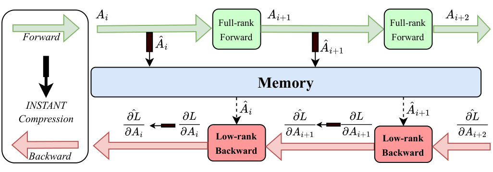
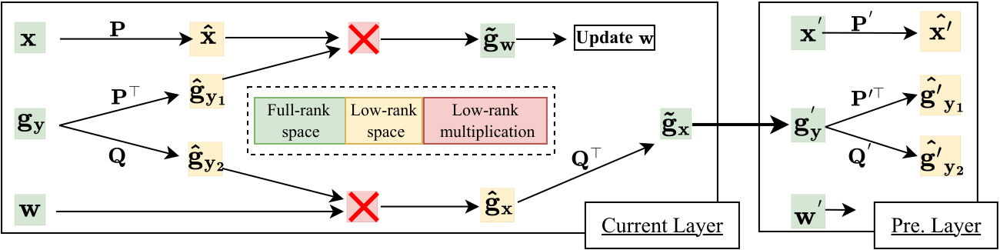

# INSTANT: COMPRESSING GRADIENTS AND ACTIVATIONS FOR RESOURCE-EFFICIENT TRAINING
> Tuan-Kiet Doan, Trung-Hieu Tran, Enzo Tartaglione, Nikola Simidjievski & Van-Tam Nguyen

Official repository for the paper `INSTANT: COMPRESSING GRADIENTS AND ACTIVATIONS FOR RESOURCE-EFFICIENT TRAINING` accepted in [ICLR 2026](https://openreview.net/forum?id=P2q6Y7UweV).

<details><summary>Abstract</summary>
Deep learning has advanced at an unprecedented pace. This progress has led to a significant increase in its complexity. However, despite extensive research on accelerating inference, training deep models directly within a resource-constrained budget remains a considerable challenge due to its high computational and memory requirements. In this paper, we introduce INSTANT (compressIng gradieNtS and acTivAtions for resource-efficieNt Training), a method designed to address both the computational and the memory bottlenecks when training. INSTANT reduces resource demands during backpropagation by projecting gradients and activations into a low-rank subspace and performing computation within that compressed representation. Experimental results demonstrate that INSTANT achieves a 15× reduction in computational cost and 32× reduction in activation memory with negligible impact on model performance. 
</details>

## Compressing Gradients and Activations

INSTANT compresses both activations and gradients to optimize training efficiency:

* **Forward Pass (Green):** The activation $A_i$ propagates normally in full-rank space. Meanwhile, a compact version, $\hat{A}_i$, is saved for backpropagation to significantly reduce memory consumption.
* **Backward Pass (Red):** The gradient with respect to the output, 
  $\frac{\partial L}{\partial A_{i+1}}$, is projected into a low-rank 
  subspace, yielding a compressed representation 
  $\widehat{\frac{\partial L}{\partial A_{i+1}}}$.

* **Efficient Computation:** Low-rank operations are then performed 
  using the compressed activation $\hat{A}_i$ and the compressed gradient 
  $\widehat{\frac{\partial L}{\partial A_{i+1}}}$, significantly reducing 
  the computational cost of the backward pass.

<p align="center">
  
</p>

---

## Low-Rank Backpropagation

The low-rank backpropagation algorithm powered by INSTANT streamlines gradient calculations. Instead of relying on **full-rank multiplication** like standard (Vanilla) methods, INSTANT decomposes $\mathbf{x}$ and $\mathbf{g_y}$. This allows it to accurately approximate $\mathbf{g_w}$ and $\mathbf{g_x}$ entirely through **low-rank multiplications**, saving processing power and time.

<p align="center">
  
</p>

# Computer Vision tasks and Language tasks
Please follow directory [computer_vision](computer_vision) and [language](language), repectively.

# References
If you use this code, plese consider citing this work as:
```
@inproceedings{
doantran2026instantcompressinggradientactivation,
title={INSTANT: COMPRESSING GRADIENTS AND ACTIVATIONS FOR RESOURCE-EFFICIENT TRAINING},
author={Tuan-Kiet Doan, Trung-Hieu Tran, Enzo Tartaglione, Nikola Simidjievski, and Van-Tam Nguyen},
booktitle={The Fourteenth International Conference on Learning Representations},
year={2026},
url={https://openreview.net/forum?id=P2q6Y7UweV}
}
```

# License
See [LICENSE](LICENSE).

